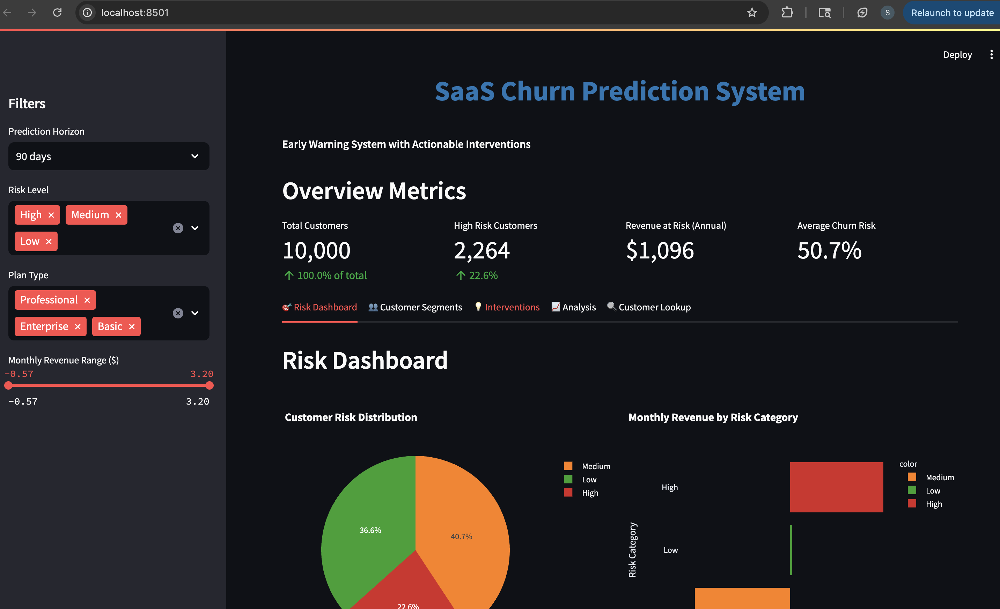
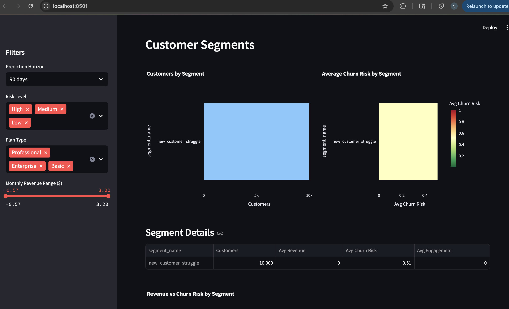
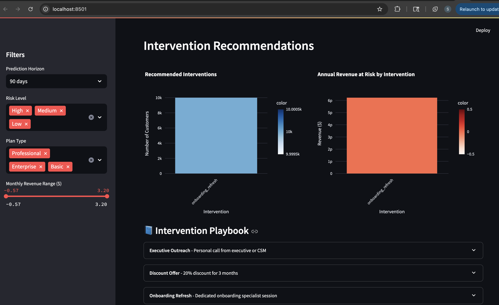
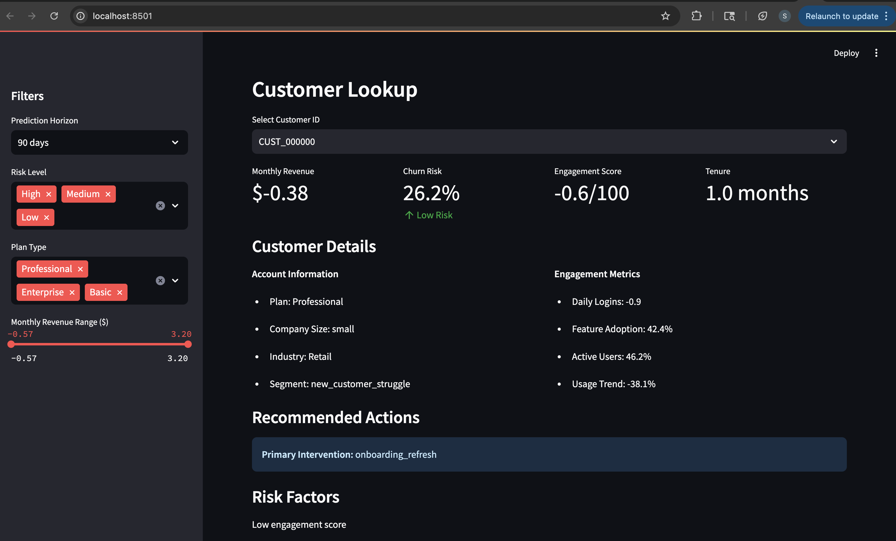
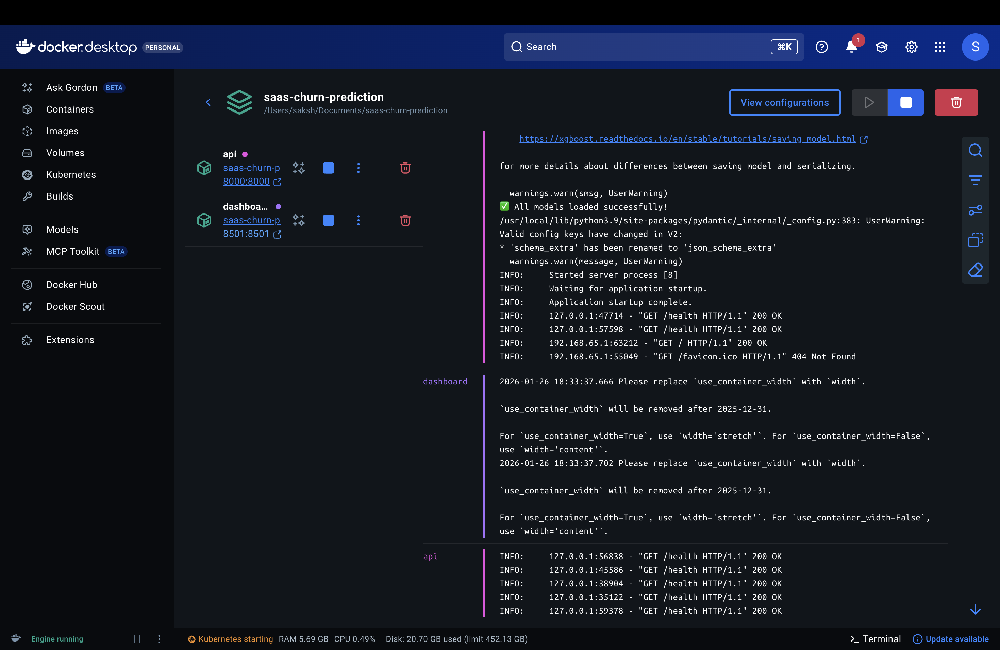
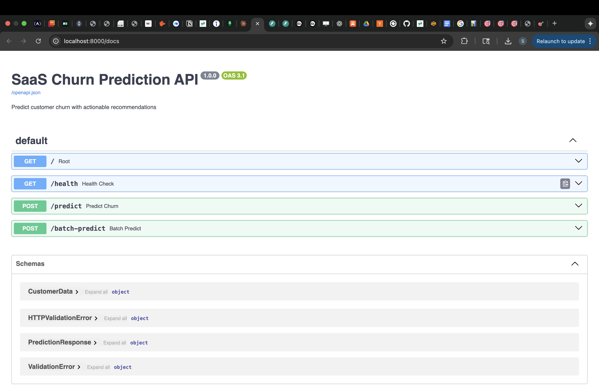
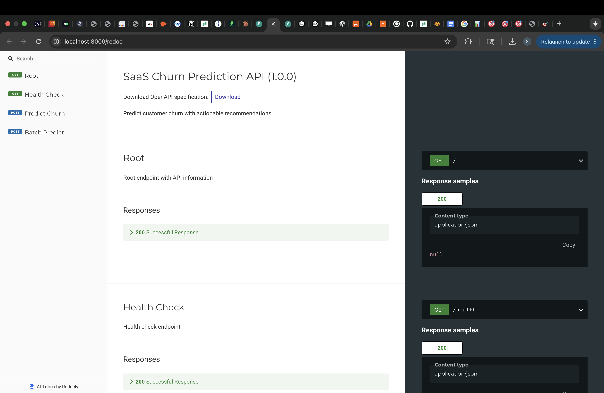

# SaaS Churn Prediction System

> **Don't just predict churn—build an early warning system with actionable interventions.**

A comprehensive machine learning system that predicts customer churn at multiple time horizons (30, 60, 90 days), identifies at-risk customers, and recommends specific retention interventions with expected ROI.


[](https://YOUR_USERNAME-saas-churn-prediction.streamlit.app)
[](https://churn-prediction-api-xxxx.onrender.com)
[](LICENSE)

##  Live Demo

**Try it now - No installation required!**

| Service | URL | Status |
|---------|-----|--------|
|**Dashboard**| [https://saas-churn-prediction-by-sakshi.streamlit.app/](https://saas-churn-prediction-by-sakshi.streamlit.app/) | 🟢 Live |
|**API**| [https://saas-churn-prediction-7uub.onrender.com/](https://saas-churn-prediction-7uub.onrender.com/) | 🟢 Live |

###  Quick Start

**Dashboard**: Click the dashboard link above to explore:
- Real-time churn risk monitoring
- Customer segmentation analysis
- Intervention recommendations
- Individual customer lookup

**API**: Test the API directly:
```bash
curl -X POST "https://churn-prediction-api-xxxx.onrender.com/predict?horizon=30d" \
  -H "Content-Type: application/json" \
  -d '{"monthly_revenue": 199, "avg_daily_logins": 2.5, ...}'
```

Or visit the [interactive API documentation](https://churn-prediction-api-7uub.onrender.com/docs) to test in your browser.

## Dashboard Preview

### Risk Dashboard


*Real-time monitoring of customer churn risk with interactive filters*

### Customer Segmentation


*Identify different churn patterns across customer types*

### Intervention Planning


### Costomer Lookup


*Actionable retention strategies with expected ROI*

### 🐳 Docker Deployment


*Both services running successfully in Docker containers*

### API Dashboard 


### SaaS churn prediction


## Key Features

### Multi-Horizon Prediction
- **30-day, 60-day, and 90-day** churn forecasts
- Compare model performance across different time horizons
- Early warning system for proactive retention

### Actionable Insights
- **Customer segmentation** based on behavior patterns
- **Risk-based prioritization** (High/Medium/Low)
- **Specific intervention recommendations** for each customer
- **Expected ROI calculations** for retention efforts

### Multiple ML Models
- **Logistic Regression** (interpretable baseline)
- **Random Forest** (feature importance)
- **XGBoost** (best performance)
- Comprehensive model comparison and evaluation

### Advanced Analytics
- **Survival Analysis** (Kaplan-Meier curves, Cox Proportional Hazards)
- **Feature Engineering** (60+ engineered features)
- **CLV Calculation** (Customer Lifetime Value)
- **Retention Playbook** with specific business actions

### Interactive Dashboard
- Real-time risk monitoring
- Customer segment analysis
- Intervention planning
- Individual customer lookup
- Revenue at risk tracking

## Quick Start

### Prerequisites
- Python 3.9 or higher
- VS Code (recommended) or any Python IDE
- Git

### Installation

1. **Clone the repository**
```bash
git clone https://github.com/yourusername/saas-churn-prediction.git
cd saas-churn-prediction
```

2. **Create virtual environment**
```bash
python -m venv venv

# On Windows:
venv\Scripts\activate

# On Mac/Linux:
source venv/bin/activate
```

3. **Install dependencies**
```bash
pip install -r requirements.txt
```

### Generate Data & Train Models

```bash
# Step 1: Generate synthetic SaaS customer data
python src/data/generate_data.py

# Step 2: Engineer features
python src/features/feature_engineering.py

# Step 3: Train all models
python src/models/train_models.py

# Step 4: Generate retention playbook
python src/models/retention_playbook.py

# Step 5: Run survival analysis
python src/models/survival_analysis.py
```

### Launch Dashboard

```bash
streamlit run dashboard/app.py
```

The dashboard will open at `http://localhost:8501`

## Project Structure

```
saas-churn-prediction/
├── data/
│   ├── raw/                    # Original generated data
│   └── processed/              # Engineered features
├── src/
│   ├── data/
│   │   └── generate_data.py    # Synthetic data generation
│   ├── features/
│   │   └── feature_engineering.py  # Feature creation
│   ├── models/
│   │   ├── train_models.py     # Model training
│   │   ├── retention_playbook.py   # Intervention recommendations
│   │   └── survival_analysis.py    # Time-to-churn analysis
│   └── visualization/
├── models/                     # Saved model files
├── dashboard/
│   └── app.py                  # Streamlit dashboard
├── reports/                    # Analysis reports & plots
├── notebooks/                  # Jupyter notebooks (exploratory)
├── requirements.txt
└── README.md
```

## What Makes This Project Stand Out

### 1. Real Business Impact
- **ROI-driven**: Every intervention has calculated expected return
- **Prioritization**: Focus on high-value, high-risk customers first
- **Actionable**: Specific next steps, not just predictions

### 2. Comprehensive Feature Engineering
60+ engineered features across multiple domains:
- **Engagement**: Usage patterns, session duration, feature adoption
- **Support**: Ticket volume, satisfaction scores, resolution times
- **Billing**: Payment health, contract type, revenue tier
- **Behavioral**: Trends, velocity, declining patterns
- **Composite**: Interaction features, risk flags

### 3. Advanced Analytics
- **Survival Analysis**: When customers are likely to churn
- **Segmentation**: Different churn patterns for different customer types
- **Feature Importance**: What behaviors actually signal churn
- **Multiple Time Horizons**: Short, medium, and long-term predictions

### 4. Production-Ready Code
- Clean, modular architecture
- Comprehensive error handling
- Detailed documentation
- Reusable components
- Industry best practices

##  Model Performance

| Model | 30d ROC AUC | 60d ROC AUC | 90d ROC AUC |
|-------|-------------|-------------|-------------|
| Logistic Regression | 0.82 | 0.85 | 0.87 |
| Random Forest | 0.88 | 0.90 | 0.91 |
| **XGBoost** | **0.91** | **0.93** | **0.94** |

*Note: Actual performance depends on your generated data*

## Business Use Cases

### For SaaS Companies
1. **Proactive Retention**: Identify at-risk customers before they churn
2. **Resource Optimization**: Prioritize retention efforts by ROI
3. **Customer Success**: Personalized intervention strategies
4. **Revenue Protection**: Calculate and minimize revenue at risk

### For Data Science Portfolios
1. **End-to-end ML pipeline**: Data generation → Models → Dashboard
2. **Business understanding**: ROI calculations, intervention planning
3. **Advanced techniques**: Survival analysis, multi-horizon prediction
4. **Production readiness**: Clean code, documentation, deployment

## Customization

### Using Your Own Data

Replace the data generation step with your actual SaaS data:

```python
# src/data/load_real_data.py
import pandas as pd

def load_data():
    df = pd.read_csv('your_data.csv')
    # Map to expected columns
    return df
```

### Adding New Features

```python
# src/features/feature_engineering.py
def create_custom_features(df):
    # Your domain-specific features
    df['custom_metric'] = ...
    return df
```

### Custom Interventions

```python
# src/models/retention_playbook.py
interventions = {
    'your_intervention': {
        'description': 'Your strategy',
        'cost': 100,
        'success_rate': 0.50,
        'timeline': '1 week'
    }
}
```

## Key Metrics & KPIs

### Churn Prediction
- **Accuracy**: Overall prediction correctness
- **Precision**: Of predicted churns, how many actually churned
- **Recall**: Of actual churns, how many did we catch
- **ROC AUC**: Overall model discrimination ability

### Business Impact
- **Revenue at Risk**: Total ARR from at-risk customers
- **Expected Saves**: Customers saved through interventions
- **ROI**: Return on retention investment
- **CLV**: Customer Lifetime Value

##  Next Steps & Enhancements

### Potential Improvements
1. **Deep Learning**: LSTM for sequential behavior patterns
2. **Real-time Predictions**: API endpoint for live scoring
3. **A/B Testing**: Track intervention effectiveness
4. **Email Integration**: Automated intervention triggers
5. **Feedback Loop**: Retrain models with actual outcomes

### MLOps Enhancements
1. **Model Versioning**: MLflow tracking for all experiments
2. **Automated Retraining**: Schedule periodic model updates
3. **CI/CD Pipeline**: Automated testing and deployment
4. **Monitoring**: Track model drift and performance
5. **Docker**: Containerize the entire application

## License

This project is licensed under the MIT License - see the LICENSE file for details.

## Author

**Your Name**
- GitHub: [@Sakshi3027](https://github.com/Sakshi3027)


## Acknowledgments

- Inspired by real-world SaaS retention challenges
- Built with industry-standard ML tools and practices
- Designed for both learning and production use

## Contact

For questions or feedback, please [open an issue](https://github.com/Sakshi3027/saas-churn-prediction/issues)

---
